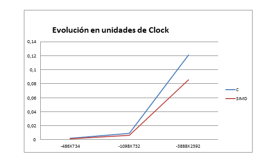

# TP2 Orga II


## Descripción 
En el presente trabajo se presentará un programa tanto en assembler como en lenguaje C que permita combinar dos imagenes en base a una mascara, la cual es un imagen con solamente pixeles blancos y negros, donde en la imagen resultante los pixeles negros corresponde a la iamgen1  y los blancos a la iamgen 2. Para obtener resultados coherentes, se utilizarán imagenes del mismo tamaño.<p>
El objetivo de realizar esta aplicacion en dos entornos diferentes es comparar la performance de las instrucciones SIMD con las instrucciones aritmeticas y logicas de la ALU.

## Pre-Requisitos 📋
Los siguientes comandos se ejecutan en la terminal de Linux: 

**Clonar el repositorio**
```
sudo apt update
sudo apt-get install git
git clone https://gitlab.com/martinzavallagamarra/tp2-orga-ii.git 
```
**Uso de gcc**
```
sudo apt-get update
sudo apt-get install gcc 
```
**Uso de Nasm**
```
sudo apt-get update
sudo apt-get install nasm 
```
**Uso de GraphicsMagick**
```
sudo apt-get update
sudo apt-get install graphiscmagick 
```
_Nota: No es necesario hacer el update en cada paso, con hacerlo una vez al principio es suficiente._

## Ejercicio: Enmascarar 

### Pautas:
- Usar GraphicsMagick para independizarse del formato de imagen.
- Desarrolar una aplicacion de linea de comando que combine dos imagenes usando una mascara de seleccion.
- Implementar una funcion enmascar_Asm en ensamblador de 32 usando instrucciones SIMD y pasaje de parametros.
- Implementar una funcion enmascar_C  en lenguaje C.
- Medir el tiempo de cada funcion

### Resolución 🔧

#### Codigo C
**Para obtener los atributos** pasados por linea de comado (imagen1  iamgen2  mascara alto ancho) **se utiliza argc y *argv[]**.Este ultimo es un vector de punteros *char , que en cierta forma podemos decir que es un vector de strings.<p>
Se empieza el codigo declarando todas las variables a usar y a continuacion se las instancia. Primero se guarda los nombres de los archivo donde estan las imagenes/mascara y despues usando la funcion atoi , que permite pasar de "String" a entero, guardamos los valores del alto y ancho.<p>
Tambien se define el tamaño de un RGB, este nos servira para mas adelante reservar la memoria necesaria.   
```
int main(int argc, char *argv[])  
{
    unsigned char *buffer1,*buffer2,*buffermask,*bufferAux;
    char *img,*img2,*mask,*alt;
    int alto,ancho,imagenSize;
    double tiempoC,tiempoAsm;
    clock_t inicio,fin;

    int RGB_size = 3; //en bytes
    img = argv[1];
    img2 = argv[2];
    mask = argv[3];
    alto = atoi(argv[4]);
    ancho = atoi(argv[5]);
    ...
```
_Nota: En argv[0] se encuentra el nombre del archivo.C por eso no es usado._<p>
_Nota2: RGB = [255,255,255] = [8bits,8bits,8bits] = [1byte,1byte,1byte] = 3bytes._

A continuacion, **reservamos memoria para cada buffer** , para esto usamos la **funcion malloc** que no pide el tamaño de los datos a reservar y la cantidad en bytes. Luego, se usa la funcion cargarBuffer,para meter la informacion de las fotos en el buffer correspondiente **y free para liberar la memoria** de los buffer para cuando no se usen mas.
```
    ...
    imagenSize = alto * ancho * RGB_size;
    buffer1 = (unsigned char *)malloc(imagenSize);
    buffer2 = (unsigned char *)malloc(imagenSize);
    buffermask = (unsigned char *)malloc(imagenSize);
    bufferAux = (unsigned char *)malloc(imagenSize); 
    
    cargarBuffer(img,buffer1,imagenSize);
    cargarBuffer(img2,buffer2,imagenSize);
    cargarBuffer(mask,buffermask,imagenSize);
    cargarBuffer(img,bufferAux,imagenSize);
    ...
    free(buffer1);
    free(buffer2);
    free(buffermask);
    free(bufferAux);
    return 0;
}
```
_Nota: La funcion malloc pertence a la libreria stdlib.h._

Lo mas importante a destacar de cargarBuffer es el uso del **tipo FILE y su funcion fopen** que solicita un nombre y el modo en que se usara, en nuestro caso "rb" hace referencia que el archivo designado se leera byte por byte. Despues, se usa **fread para guardar la informacion del archivo** (imagen) en un buffer.
```
int cargarBuffer(char *imagen, unsigned char * buffer,int cant_bytes)
{
    FILE *archivo = fopen(imagen,"rb");
    ...
    fread(buffer,cant_bytes,sizeof(unsigned char),archivo);    
    fclose(archivo);
}
```
Tanto para enmascar_Asm y enmascar_C, **se medira el tiempo de procesamiento de imagen**, para esto **se usa la funcion clock()** que maracara un inicio y fin para luego, en base a estos, calcular el tiempo transcurrido.
```
    ...
    inicio=clock();
    enmascarar_c(buffer1,buffer2,buffermask,imagenSize);
    fin=clock();
    tiempoAsm = (double)(fin-inicio)/CLOCKS_PER_SEC;
    printf("Imagen tamano: %d x %d\n",alto,ancho);
    printf("Tiempo en C : %.6f\n",tiempoAsm);

    inicio=clock();
    enmascararAssembler(buffer1,buffer2,buffermask,imagenSize);
    fin=clock();
    tiempoC = (double)(fin-inicio)/CLOCKS_PER_SEC;
    printf("Imagen tamano: %d x %d\n",alto,ancho);
    printf("Tiempo en ASM : %.6f\n",tiempoC);
    ...
```
_Nota: La funcion clock pertence a la libreria time.h_

La logica dentro de la funcion enmascar_C es recorrer el buffer de la mascara y consultar por cada conjunto de 3 bytes si forman un RGB blanco ,es decir,[255,255,255]. En caso afirmativo , ese conjunto de 3 bytes del buffer correspondiente a **la imagen1 seran remplazados por los de la imagen 2.**
Al terminar de recorrer todo el buffer, **se procedera a crear una archivo** de salida nuevo y se escribira con la informacion del buffer de la imagen 1 recientemente modificada.
```
int enmascarar_c(unsigned char *buff1 ,unsigned char *buff2 ,unsigned char *buffMask,int cant)
{
    int i=0;
    while(i<cant)
    {
        if (buffMask[i]==255 && buffMask[i+1]==255 && buffMask[i+2]==255)
        {
            buff1[i] = buff2[i];
            buff1[i+1] = buff2[i+1];
            buff1[i+2] = buff2[i+2];           
        }
        i+=3;
    }
    FILE *archivo_C = fopen("salida.rgb","wb");
    fwrite(buff1,cant,1,archivo_C);
    fclose(archivo_C);    
}
```
En enmascararAssembler esta contenida enmascarar_asm (llamada a funcion externa de assembler)y la escritura ya que **al calcular el tiempo de procesamiento se tiene en cuenta la escritura del archivo de salida.** 
```
void enmascararAssembler(unsigned char *buff1 ,unsigned char *buff2 ,unsigned char *buffMask,int cant)
{
    enmascarar_asm(buff1,buff2,buffMask,cant);

    FILE *archivo_Asm = fopen("salida2.rgb","wb");
    fwrite(buff1,cant,1,archivo_Asm);
    fclose(archivo_Asm);
}
```
_Nota: La funcion enmascarar_Asm se declara con la etiqueta extern al principio del codigo_

#### Codigo assembler

**Definimos el valor del blanco** en la seccion de Datos y en la seccion de text **se define la variable global** con el mismo nombre con el que es invocado desde C. Tambien remarcamos el uso del comando **enter** (push ebp - mov ebp,esp) y **leave** (mov esp,ebp -push ebp) que permiten el alineaminto de los punteros de la pila para un manejo mas organizado al momento de recibir parametros desde c. 
```
section .data
pixelNegro db 0

section .text
    global enmascarar_asm

enmascarar_asm:
push ebp
mov ebp,esp
...
mov esp,ebp
pop ebp

ret
```
**Se guardan en los registros de proposito general los punteros a las imagenes(recordemos que estan en buffers)** y un puntero que guarda el tamaño de la imagen.<p>
Por otro lado, usamos el registro esi para avanzar por el archivo y en edi se guarda el valor declarado antes.
```
mov eax , [ebp+8] ;img1
mov ebx , [ebp+12] ;img2
mov ecx , [ebp+16] ; mask
mov edx , [ebp +20] ; imgSize
mov esi , 0
mov edi , [pixelNegro]
```

Usando registro de SSE (xmm) guardamos los valores de los punteros, y dependiendo de el valor, si es pixel negro, simplemente avanzo a la siguiente posicion. Caso contrario muevo el contenido de la imagen 2 y lo guardo en la posicion de memoria de la primer imagen.Se repite estos pasos hasta terminar la imagen.
```
ciclo:
movd xmm0,[eax+esi]
movd xmm1,[ebx+esi]
cmp [ecx+esi] , edi
je esPixelNegro 
movd [eax+esi],xmm1

esPixelNegro:
add esi,4
cmp esi , edx
jb ciclo
```

### Ejemplos 🚀
_Nota: Los tiempos dependen del tamaño de la imagen/mascara_ 
* **Tiempos de procesamiento por tamaños**<p>

* **Resultado del enmascaramiento** <p>


## Ejecucion 📦
Se puede notar en los ejemplos que para ejecutar el programa se hace uso de un archivo .sh.
1. Al  principio se encuentran los comandos para compilar el codigo assembler (nasm) y el codigo C (gcc).
2. Se convierten las imagenes/mascara a formato rgb.
3. Se ejecuta el programa compilado previamente y se le pasan los parametros (imagenes.rgb , ancho y alto).
4. Transformar la salida del programa de .rgb a jpg especificando el tamaño y una profundidad (obligatoria para formatos .rgb porque no lo tienen).
5. borrar archivos .rgb que ya no se usan. 
```
#!/bin/bash
nasm -f elf filtro.s -o filtro.o
gcc -m32 filtro.o filtro.c -o filtro

gm convert paisaje.jpg paisaje.rgb
gm convert lobo.jpg lobo.rgb
gm convert boceto.jpg boceto.rgb

./filtro "paisaje.rgb" "lobo.rgb" "boceto.rgb" 3888 2592

gm convert -size 3888x2592 -depth 8  salida.rgb  salida.jpg
gm convert -size 3888x2592 -depth 8  salida2.rgb  salida2.jpg

rm paisaje.rgb lobo.rgb boceto.rgb salida.rgb salida2.rgb 
```
### Conclusion
Mediante el presente trabajo podemos concluir que la utilización de SIMD nos brinda mayores ventajas al implementar operaciones paralelizables, 
cómo en este caso el procesamiento de imágenes.
En los siguientes graficos se muestran las diferencia de implementar ambas.


* **Se puede destacar que el rendimiento de SIMD es superior a C** <p>




## Autor ✒️
- Martin Zavalla Gamarra.
- Melina Alejandra Cueva.

